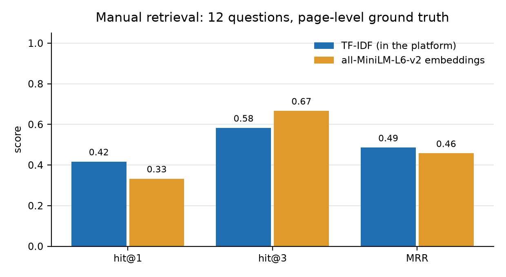
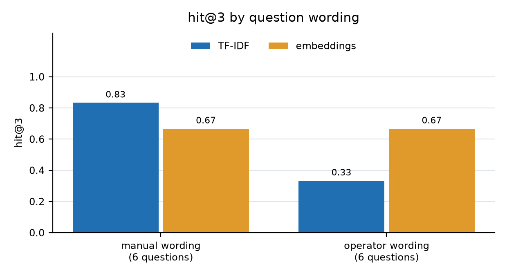
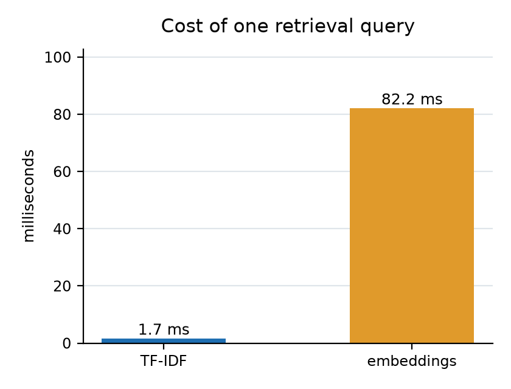
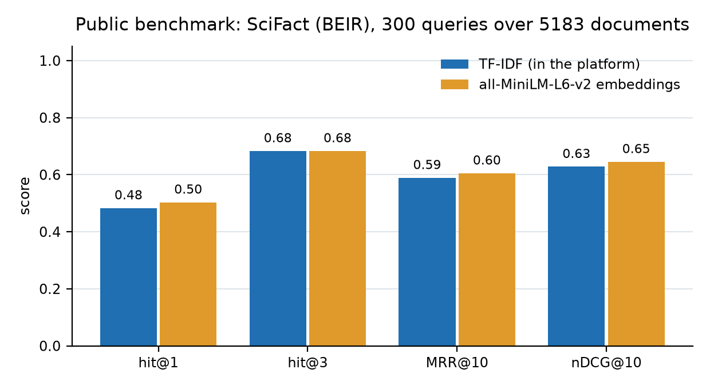
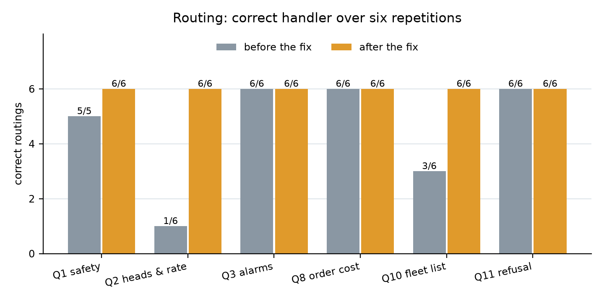

# Project Q2 - Design Documentation

**Multi-Agent AI Framework for Industrial Fleet Management and Autonomous Troubleshooting**
System and Device Programming, A.Y. 2025-2026 - Politecnico di Torino / AROL S.p.A.

Installation and usage instructions are in `README.txt`. This document explains
*why* the system is built the way it is.

---

## 1. Scope

The platform lets a plant operator scan the QR code on a machine, reach the page
of that machine (data and use-and-maintenance manual) and ask questions to an AI
chatbot. The chatbot is an orchestrator that delegates the question to one of
three specialized agents, which read the data through tools.

What we implemented:

* back-end of the chatbot (sessions, chat API, conversation persistence),
* front-end of the chatbot (mobile-first web UI reached by QR code),
* the agent architecture (three agents, twelve tools),
* the orchestrator (intent routing, access control, tool-calling loop, memory).

---

## 2. Architecture

```
    Operator's phone / browser
              |
   React frontend (Vite, port 5173)
     Login / Fleet / Machine page (Assistant | Manual | QR code)
              |  REST, JSON, session token
   FastAPI backend (port 8000)
              |
        ORCHESTRATOR
     1. route the question       -> manuals | diagnostics | commercial | general
     2. check the access model   -> refuse explicitly if out of scope
     3. run the agent            -> tool-calling loop with the model
              |
   +----------+-----------+-----------------------+
   |                      |                       |
 Manuals agent      Diagnostics agent       Commercial agent
   |                      |                       |
 search_manual      telemetry / alarms /      quotes / revisions /
 machine data       tickets / manual          orders
   |                      |                       |
 TF-IDF index over   SQLite database built from the Excel workbook
 the manual PDFs
              |
   Cerebras qwen-3.8-27b, or any OpenAI-compatible API (set in .env)
```

Everything runs in two local processes plus the model API. We did not add a
message broker, a vector database service or containers. The dataset is small (8
machines, 5760 telemetry rows, 1117 manual pages) and one backend process answers
every query in a few milliseconds, so those pieces would only have added setup
work.

**The model.** `backend/llm.py` is the only file that knows which provider we
use. It talks to an OpenAI-compatible endpoint, so changing provider means
changing three lines in `.env`. We use `qwen-3.8-27b` on Cerebras: the free tier
needs no credit card and nothing has to be downloaded. On a free tier the limit is
requests per minute, not tokens, and one question costs 2 to 4 requests (routing,
then the agent and its tool rounds), so several questions asked quickly can hit
the limit. The client waits and retries instead of failing. A local model in
Ollama uses the same API and the same three settings, so it is our fallback if
there is no internet during the demonstration.

### Why three agents

The dataset splits into three domains, and its access model is defined on exactly
those three. With one agent per domain, choosing the agent and checking the
permission become the same decision, which keeps the orchestrator short. Each
agent also sees 3 to 7 tools instead of twelve, and the model picks the right tool
more often when the list is shorter.

The diagnostics agent also has `search_manual`, because troubleshooting is the
one workflow that really needs two sources: the alarm code comes from the
database, its cause and remedy from the manual of that machine. A separate
"troubleshooting agent" that had to call another agent would add a layer without
adding anything new.

### Mapping to the agents named in the project brief

The brief names three agents. Two of ours have a different name, and two phrases
in the brief have no direct counterpart in the dataset, so we write the mapping
down here.

| Brief | Ours | Where |
|---|---|---|
| Doc-Agent, "RAG over technical PDFs" | `manuals` | `search_manual`, TF-IDF index over the machine manuals |
| Telemetry-Agent, "connects to IoT data streams to diagnose machine health" | `diagnostics` | `get_telemetry_summary`, `get_recent_telemetry`, `get_alarms`, `get_alarm_statistics` |
| Business Agent, "order history and maintenance contracts from the corporate database" | `commercial` | `list_orders`, `get_order_details`, `list_quotes`, `get_quote_details` |

**"IoT data streams".** The dataset has no live stream. `TelemetrySnapshots` is
the measurement stream itself, already aggregated per hour, and `Alarms` is what
the layer that evaluates it produced. So the telemetry tools read a table. If a
real IoT platform were connected, only the bodies of `get_telemetry_summary` and
`get_recent_telemetry` would change; the agent, the orchestrator and the UI would
stay the same. The diagnosis does not come from the data source anyway, it comes
from the comparison: the tool returns the machine's own `configurationProfile`
next to the measured averages, and the agent is told to compare them.

**"Maintenance contracts".** The dataset has no contracts table. The nearest
things exist in two different domains, and we followed the domains:

* *Sold* service is content of quotations and orders ("PK 314 closure head
  overhaul kit, 20 heads, 12000 h scheduled service", "EAGLE VA turret general
  overhaul, 24000 h", lubrication service kits). It is reached through
  `get_quote_details` and `get_order_details`, in the **commercial** agent.
* *Performed* service is `MaintenanceTickets`, and the access model of the
  dataset puts that table in the operational domain, closed to a `commercial`
  user. It is therefore a tool of the **diagnostics** agent.

Here the brief and the dataset disagree: the brief puts maintenance next to
orders in one business agent, the dataset closes maintenance to a commercial user.
We followed the dataset, because it is the document that says who may read what. A
commercial user asking about maintenance work is refused instead of being served
by an agent that was allowed to read it.

**Confirmed with AROL (September 2026).** We put the three readings above to
Elia Ferraro and Alessio Chessa of AROL before the discussion. Their answers:
reading `TelemetrySnapshots` is sufficient and a simulated live stream is out of
scope; there is no contracts domain in the dataset and no contract management is
expected; the maintenance split must follow the access model, because
"respecting permissions is more important than providing a more complete
answer"; accumulated working hours are to be treated as unavailable rather than
estimated; and for the evaluation "the architectural separation between
orchestrator, agents and tools is more important than implementing a full MCP
server", so documenting that decision is accepted.

---

## 3. Data layer

### 3.1 Structured data: Excel to SQLite

`backend/load_data.py` copies each sheet of the workbook into a table with the
same name and columns (`data/arol.db`). We copy it literally, with no renaming,
no type conversion and no computed columns, so the database can be checked against
the workbook by eye. Empty cells become `NULL`, which matters
because some foreign keys are intentionally empty.

We chose SQLite because it is a single file, needs no server and does the joins
the tools need. Three extra tables that are not in the workbook hold the
platform's own state: `Sessions`, `Messages` and `Credentials`.

The tools run fixed, parameterized SQL queries. We did not let the model write
SQL. With text-to-SQL the model would be the component that decides which rows are
read, and that is the decision the access model has to keep.

### 3.2 Unstructured data: RAG over the manuals

`backend/build_index.py` extracts the text of every page of every manual with
`pypdf`, drops the copyright footers, discards pages with less than 100
characters (title pages and figure-only pages) and indexes the remaining 1117
pages with a TF-IDF vectorizer from scikit-learn. `search_manual` transforms the
question with the same vectorizer and returns the 3 pages with the highest
cosine similarity, restricted to the manual of the machine being discussed.

**One page = one chunk.** Manual pages are short (300 to 4000 characters) and
usually contain one procedure or one table, so the page is a natural chunk. It
also gives a citation the user can check: "manual page 90".

**Why TF-IDF and not sentence embeddings.** The queries that matter here are
technical terms taken from alarm mnemonics and from the machine vocabulary
("low air pressure", "closure head", "caps sorter", "scheduled maintenance").
Lexical matching is strong on exactly this kind of query, while embeddings help
most with paraphrase. TF-IDF also needs no model download, no GPU and no
vector database process, and the whole index rebuilds in about ten seconds. The
cost is that a question sharing no word with the manual finds nothing useful; the
agent is told to say so instead of guessing.

**Filtering before ranking.** Manuals are machine-specific: two machines of the
same model have different manuals. `search_manual` selects the chunks of the
serial number of the requested machine first, then ranks. This makes it
impossible to answer a question about one machine with another machine's manual.

---

## 4. Access model

Two independent checks, both enforced server-side, in `backend/access.py`:

1. **Tenant boundary.** Every query filters on the `companyId` of the logged-in
   user. `access.get_machine()` resolves a machine id or serial number *within
   the user's company only*, and every tool that takes a machine goes through
   it. A machine of another company and a machine that does not exist give the
   same answer, so the platform does not disclose the existence of other
   customers' machines.
2. **Visibility.** `full` sees everything, `technician` has no access to quotes
   and orders, `commercial` has no access to telemetry, alarms and maintenance.
   Machines, models and manuals are visible at every level.

We check twice, for two different reasons:

* in the orchestrator, right after routing: if the user's visibility does not
  cover the agent's domain, the agent is never started and the user gets an
  explicit refusal naming their visibility level;
* in every tool, as a second line of defence: if a tool is somehow reached by an
  agent that should not have run, it returns an `ACCESS DENIED` error instead of
  data.

A refusal is always a sentence. The dataset requires that a refused request must
never look like an empty result, which is why every refusal is a message and not
an empty list.

---

## 5. Agents and tools

| Agent | Domain | Tools |
|---|---|---|
| `manuals` | identity + documentation (all users) | `list_machines`, `get_machine_details`, `search_manual` |
| `diagnostics` | operational (`full`, `technician`) | `get_machine_details`, `get_telemetry_summary`, `get_recent_telemetry`, `get_alarms`, `get_alarm_statistics`, `get_maintenance_tickets`, `search_manual` |
| `commercial` | commercial (`full`, `commercial`) | `list_machines`, `list_quotes`, `get_quote_details`, `list_orders`, `get_order_details` |

An agent is a dictionary in `backend/agents.py`: the data domain it needs, a
description used by the router, its system prompt and the names of its tools.
Adding an agent means adding an entry; there is no class hierarchy.

Design rules the tools follow:

* **Aggregate in SQL, not in the model.** `get_telemetry_summary` turns 30 days
  of telemetry into about a dozen numbers, and `get_alarm_statistics` returns how
  often each alarm code occurred. Counting 720 rows is work for SQL; sending the
  rows to the model would be slower, more expensive and less reliable.
* **Bounded results.** Lists are capped (25 alarms, 25 tickets, 24 snapshots)
  and the JSON sent back to the model is truncated at 6000 characters.
* **Context with the data.** `get_telemetry_summary` also returns the machine's
  `configurationProfile`, so that the model compares an average of 34393 bph
  against the 40000 bph of *that* machine and not against its model family.
* **Errors are sentences.** A refusal or a missing machine comes back as a
  short instruction the model can relay to the user.

---

## 6. Orchestrator

`backend/orchestrator.py`, one turn of conversation:

1. the user message is saved in `Messages`;
2. **routing**: one LLM call with a prompt listing what each agent handles, and
   the instruction to answer with a single word. The reply is matched against
   the agent names; anything unrecognized falls back to the manuals agent.
   `general` handles greetings and questions about the platform and runs without
   tools. The prompt also states where the borderline cases go: machine
   identity and the fleet list are always `manuals`, and `diagnostics` is only
   for how a machine is running now. Those were the questions the router got
   wrong, see section 9;
3. **access check** (section 4);
4. **agent loop**: system prompt + the last 6 messages of the session + the new
   question, sent to the model with the agent's tool schemas. While the model
   answers with tool calls, the tools are executed and their JSON results are
   appended to the conversation. At most 4 rounds; if the model is still calling
   tools it is asked once for a plain answer;
5. the answer is saved with the name of the agent that produced it, and returned
   together with the manual pages that were retrieved, which the UI shows as
   citations.

**Memory** is the last 6 messages of the session about the machine the user is
looking at, read back from SQLite. Filtering by machine matters: an operator moves
from one machine to the next, and without the filter the previous machine's turns
would arrive as context for the new one. The session token is the conversation id.
`GET /api/chat/history` returns the same rows to the interface, so reopening a
machine page shows the conversation instead of an empty panel. Each stored answer
also keeps its agent and the manual pages it cited, so a restored answer still has
its clickable citations.

**Logging.** One line per tool call and one line per turn go to the standard
logger, next to uvicorn's access log:

```
INFO arol: tool get_alarm_statistics {'machine': '15610', 'days': 30} -> ok
INFO arol: turn user=matteo.bonetti@valgrande.example visibility=technician
           agent=diagnostics machine=MCH-0001 seconds=2.6
```

With these two lines we can go back to a wrong answer and see what happened:
which agent was chosen, which tools ran with which arguments, and how long the
turn took.

**Why routing and not a single agent with twelve tools.** Routing first leaves at
most seven tools of one domain, and the model picks better from a short list. It
is also what makes the permission check possible before any data is touched: the
access model is defined on exactly the domain the router selects. The cost is one
extra model call per turn.

---

## 7. Front-end and the QR flow

React (Vite), four screens, mobile-first: a single column, large touch targets,
no UI framework. The QR code of a machine encodes
`http://localhost:5173/machines/<serialNumber>`, the URL scheme suggested by the
dataset README; the machine page accepts both the serial number and the machine
id. Scanning it:

1. opens `/machines/15610`;
2. if there is no session, the path is kept in `sessionStorage`, the user signs
   in and lands back on the machine page;
3. the page opens on the **Assistant** tab, with the manual one tab away and the
   printable QR code in the third tab. The chat is already scoped to that
   machine, so "this machine" in a question resolves to it.

The manual is shown in an `<iframe>` with the browser's own PDF viewer, which
costs nothing and works on a phone.

**A short help panel.** The fleet page top bar has a `Help` button. It opens a
panel with three steps (open a machine by QR code or from the list, read or ask,
check the answer through the cited pages) and one sentence saying what this
account's visibility lets the assistant answer. We put it behind a button instead
of above the machine list, so it does not push the machines down the page for
someone who already knows the platform.

**The conversation survives a reload.** Opening a machine page loads the last
turns of that machine from the backend before anything else, so the operator who
refreshed the page, or came back to the machine later in the same session, does
not have to ask again.

**The interface never offers what the account cannot read.** The three suggested
questions carry the data domain they need, and the list is filtered by the user's
visibility with the same mapping as `DOMAIN_PERMISSIONS` in `backend/access.py`:
a `commercial` account is not shown the alarm question, a `technician` account is
not shown the quotation one. The greeting is built the same way, so it does not
advertise telemetry to someone who may not read it. The refusals are still there
in the backend; this only stops the interface from inviting them.

**The panel looks like a chat.** It has a header with the assistant's name and an
online dot, and a round avatar next to every answer. The avatar and the label are
coloured by the agent that answered: blue for manuals, amber for diagnostics,
green for commercial. Messages fade in, a three-dot bubble is shown while the
agents work, and an empty conversation offers three suggested questions, one per
agent, so a first-time user has something to click. The icons are inline SVG and
the rest is CSS; we did not add an icon library for six small icons.

**Citations are clickable.** Each page number under a manual answer is a button.
Clicking it switches to the manual tab and opens the PDF at `#page=N`, which the
browser's PDF viewer understands, so the operator can check the answer in one
click instead of scrolling through 150 pages. The tool returns the pages in
relevance order and we sort them before showing them, because on screen the
numbers look like a list and not like a ranking.

**The logo goes back to the fleet.** On a machine page the AROL square in the top
left links to the fleet list, next to the "My fleet" button, because that is where
users expect it.

**The assistant is hidden, not unmounted.** Switching to the manual or to the QR
tab keeps the `Chat` component mounted behind a `hidden` attribute, so coming
back finds the conversation as it was. Unmounting it would throw away the
messages held in its state, and the operator would have to ask again.

**Light markdown.** The model formats answers with `**bold**` and dashed lists.
`Chat.jsx` handles exactly those two, in ten lines, instead of adding a markdown
library for two features. Anything else is shown as it was written.

---

## 8. Data situations handled explicitly

| Situation in the dataset | How the system handles it |
|---|---|
| `QuoteLines.machineId` and `MaintenanceTickets.alarmId` are sometimes empty | `LEFT JOIN` everywhere; the tickets tool reports `alarmCode: null` instead of dropping the row |
| A quotation's status is not on `Quotes` | `list_quotes` returns the highest revision of every quotation as `currentRevision`; the agent is told earlier revisions are superseded |
| `QuoteLines.price` is already net of the discount | Totals are plain sums; the agent's prompt forbids applying the discount again |
| `OrderLines` carries no item or price | `get_order_details` takes the content from the approved revision of the quote and returns the fulfilment lines separately |
| Two machines of the same model differ | Telemetry tools return the machine's `configurationProfile` with the data; the prompt requires judging against it |
| A company with users but no machines (CMP-005) | `list_machines` returns an explicit note, and the fleet page says the company owns no machine |
| A quotation ordered after its validity expired (QTE-2026-0011 / ORD-2026-0007) | `validUntil` and the order date are both returned, so the agent can report the fact |
| A quotation whose last revision was rejected (QTE-2025-0003) | Reported through `currentRevision.revisionStatus`, with no order attached |
| Manuals are per machine, not per model | Retrieval is filtered by serial number before ranking (section 3.2) |
| Manuals schedule maintenance by working hours (40 / 500 / 1000 / 3000 / 6000 / 18000), but no table records how many hours a machine has run | The system quotes the interval from the manual and states that the accumulated running hours are not available, instead of estimating a due date. AROL confirmed this is the expected behaviour: the data is to be treated as unavailable |

Verified on the running system, asked as a technician on machine MCH-0001:

> *When is the next scheduled maintenance due for this machine?*
> "According to manual pages 94-95, scheduled maintenance intervals are grouped by
> working hours [...] However, the platform does not record how many accumulated
> running hours machine MCH-0001 has run, so the exact date or due hour for the next
> maintenance cannot be automatically calculated."

Asked directly how many hours the machine has run, the assistant again says the
platform does not track it, offers what it does have (545 hours in the Running
state over the last 30 days) and points at the machine's own hour meter. Nothing
is estimated, which is what AROL asked for.

---

## 9. Evaluation

The questions below are the test set we use. Each one has a verifiable ground
truth taken from the dataset, so an answer can be marked right or wrong. Run
them from the chat, signed in as the account in the first column.

### Functional questions

| # | Account (visibility) | Question | Expected agent | Ground truth |
|---|---|---|---|---|
| 1 | Bonetti (technician) | Which safety procedures must I follow before maintenance on this machine? | manuals | Lock-out / tag-out procedure of manual 15610, cited with page numbers |
| 2 | Bonetti (technician) | How many closure heads does this machine have and at what rate does it run? | manuals | 20 heads, 40000 bph, from `configurationProfile` of MCH-0001 |
| 3 | Bonetti (technician) | Why is machine 15610 generating repeated alarms? | diagnostics | Top codes over 30 days: AL082 (5), AL086, AL074, AL023 (4 each) |
| 4 | Bonetti (technician) | How did this machine run over the last 7 days? | diagnostics | Average uptime 70.2%, average rate 34393 bph against a nominal 40000 bph, 124 h Running |
| 5 | Bonetti (technician) | What does AL017_LOW_AIR_PRESSURE mean and what does the manual recommend? | diagnostics | Alarm present on MCH-0001 (4 times, High); remedy quoted from the manual with page numbers |
| 6 | Bonetti (technician) | What maintenance was recently performed on this machine? | diagnostics | Most recent tickets of MCH-0001: TCK-0060 (2026-08-01), TCK-0054 and TCK-0053 (2026-07-31), TCK-0048 (2026-07-30), TCK-0039 (2026-07-25), with type and status |
| 7 | Ranieri (commercial) | What was the last revision of QTE-2025-0001 and what changed? | commercial | Revision 2, Approved: photocell retrofit removed, 5% discount |
| 8 | Ranieri (commercial) | How much did order ORD-2025-0001 cost? | commercial | EUR 45837.50, from the two lines of the approved revision QREV-0002 |
| 9 | Fabbri (full) | Which quotations never became an order? | commercial | Of her own company: QTE-2025-0008 (Approved, never ordered) and QTE-2026-0014 (Draft). The unordered quotations of the other companies (QTE-2025-0003, 0006, QTE-2026-0010, 0013) must not appear: the tenant boundary applies to this question too |
| 10 | Esteves (full, CMP-005) | Which machines does my company have? | manuals | None: the company owns no machine, and this must be said explicitly |

### Access-model questions

| # | Account | Question | Expected behaviour |
|---|---|---|---|
| 11 | Bonetti (technician) | How much did this machine cost? | Explicit refusal: technician visibility excludes commercial data |
| 12 | Ranieri (commercial) | Are there any open alarms on machine 15610? | Explicit refusal: commercial visibility excludes operational data |
| 13 | Bonetti (CMP-001) | Show me machine 17478 | Explicit refusal: the machine is not in the company's fleet (it belongs to CMP-003) |
| 14 | Ranieri (commercial) | Show me quotation QTE-2025-0003 | Explicit refusal: the quotation belongs to CMP-002 |

### Results measured so far

The platform runs on `qwen-3.8-27b`. The same fourteen questions were also run on
a second provider, because `llm.py` makes the provider a line in `.env` and we
wanted to know how much of the behaviour depends on the model. Dataset snapshot
with `TODAY = 2026-08-05` in both runs.

| | `qwen-3.8-27b` (Cerebras, the default) | second provider, for comparison |
|---|---|---|
| Answers correct | 14 / 14 | 14 / 14 |
| Handled by the expected agent | 14 / 14 | 14 / 14 |
| Routing over six repetitions | 36 / 36 | 36 / 36 |
| Seconds per answer | 0.2 - 5.9, average 1.6 (all fourteen timed) | 1.7 - 4.7 (five questions timed) |

Both models answer every question correctly. This is the result we care about:
the correctness comes from the tools and the access model, not from the model.
What changes is the shape of the answer. Asked what order ORD-2025-0001 cost, the
smaller model gives the total; `qwen-3.8-27b` gives the same total and splits it
into the two lines of the approved revision. Asked why the machine keeps alarming,
it groups the codes by subsystem, connects the low-air-pressure alarm to the caps
feeding problems and cites the pneumatic checks on manual pages 97 and 98. Asked
about `AL017_LOW_AIR_PRESSURE`, it first says that the manual has no entry for the
alarm code itself and then gives the air-pressure guidance, which is correct: the
manuals describe conditions, not codes.

That is also why the default changed to this provider during the project: it is
faster (average 1.6 s), and the free tier we had used before would stall,
rate-limit at 15 requests per minute and return "experiencing high demand" for
half an hour. The raw measurement is in `evaluation/results_cerebras.json`.

Below, the first run of the set, made on the other provider.

Questions 1, 3, 4, 5, 7, 8 and access questions 11 to 13 were run first: the
right agent was selected, the tools were called with the right machine, and the
figures matched the ground truth (70.2% uptime and 34393 bph against the 40000
bph of that machine; quotation QTE-2025-0001 revision 2, photocell removed, 5%
discount, EUR 54450 becoming EUR 45837.50 without applying the discount twice).
Manual answers carried page citations.

The remaining questions were run afterwards, end to end through `POST /api/chat`:

| # | Account | Agent expected | Agent used | Answer | Seconds |
|---|---|---|---|---|---|
| 2 | Bonetti | manuals | manuals | correct: 20 heads, 40000 bph, read from `configurationProfile` | 2.4 |
| 6 | Bonetti | diagnostics | diagnostics | correct: TCK-0060, 0054, 0053, 0048, 0039 with type, status and the alarm behind each ticket | 2.6 |
| 9 | Fabbri | commercial | commercial | correct: QTE-2025-0008 (Approved, no order) and QTE-2026-0014 (Draft), no other company's quotation | 2.0 |
| 10 | Esteves | manuals | manuals | correct: states explicitly that the company owns no machine | 1.7 |
| 14 | Ranieri | commercial | commercial | correct: explicit refusal, QTE-2025-0003 belongs to another company | 2.6 |

Every answer is factually right and every question is handled by the expected
agent. Questions 2 and 10 reach that state only after the router fix described
below: on the first run they were answered correctly but by the wrong agent
(`diagnostics` and `commercial`), which is what led to the measurement.

### Routing stability

A single run says little about a classifier, so each question was routed six
times in a row (only `route()`, no agent run), before and after the fix. The
same measurement on Cerebras gives 36 correct routings out of 36 as well, so the
fix is not specific to one model:

| Question | before | after |
|---|---|---|
| Q1 - safety procedure before maintenance | manuals 5/5 | manuals 6/6 |
| Q2 - heads and production rate | diagnostics 5/6, manuals 1/6 | manuals 6/6 |
| Q3 - why repeated alarms | diagnostics 6/6 | diagnostics 6/6 |
| Q8 - how much did order ORD-2025-0001 cost | commercial 6/6 | commercial 6/6 |
| Q10 - which machines does my company have | manuals 3/6, general 2/6, diagnostics 1/6 | manuals 6/6 |
| Q11 - how much did this machine cost | commercial 6/6 | commercial 6/6 |

(Q1 has five votes before the fix: one call hit the free-tier limit of 15
requests per minute. After the fix, 36 routings out of 36 are correct.)

Questions that name a domain were already routed identically every time. The
unstable ones were exactly the two **machine identity** questions: identity was
listed in the router prompt inside a long sentence about the manuals, so a
question about heads and rate read like a diagnostics question and a question
about the fleet read like a general one.

This is not only a label. The access check is made on the domain of the agent
that was chosen, so a `commercial` user whose identity question landed on
`diagnostics` was refused, although the dataset says machine identity and
documentation are visible to every user. The error was always on the restrictive
side, never a leak, but it was a wrong answer.

The fix is two sentences in `ROUTER_PROMPT` plus a sharper description of the
manuals agent: machine identity, as-built configuration and the fleet list go to
`manuals` however technical they sound, `diagnostics` is only for how a machine
is running now or for a problem to solve, and `general` never takes a question
about data. After it, the same question asked by the `commercial` account
(Ranieri) is routed to `manuals` and answered with page citations instead of
being refused, and the technician account gets its fleet list.

### Functional checks of the platform

The fourteen questions above test the agents. They say nothing about the parts
that must behave the same way whoever is asking, so we wrote
`evaluation/functional_checks.py` for those: 59 checks that call the HTTP API and
the tools directly. There is no model call in them, so the whole run costs nothing
and takes two seconds.

| What is checked | Examples |
|---|---|
| Authentication | wrong password and unknown address give the same message; no token and an invalid token give 401 |
| Fleet | a machine resolves by serial number and by machine id; the model is joined; an unknown machine gives 404 |
| Tenant boundary | another company's machine, manual and QR code all give 404, in the API and again inside the tools |
| Visibility | each of the twelve tools, called by all three levels: allowed where the domain permits it, refused with a sentence where it does not |
| Dataset rules | the status shown for a quotation is the one of its highest revision; a company without machines gets an explicit note |
| Front-end contracts | the manual is a PDF, the QR code is a PNG, a new session has no history, and no history is returned for another company's machine |

The last run was made after rebuilding `data/arol.db` and `data/manual_index.pkl`
from the source dataset, so it also checks that the two loader scripts still
produce what the platform expects: 59 passed, 0 failed.

### Retrieval: TF-IDF against an embedding retriever

The course rules ask us to compare with an alternative instead of only reporting
numbers about our own system, and AROL agreed that this is the useful experiment
for this project. `evaluation/retrieval_comparison.py` runs both retrievers over
the same pages, with the same serial-number filter the platform applies, on twelve
questions whose answer pages were found by reading the manuals. Six questions
repeat the wording of the manual ("How is the tightening torque of the closure head
adjusted?"), six are phrased the way an operator would ask ("The caps come out too
loose, which adjustment should I check?").

| Metric | TF-IDF (in the platform) | all-MiniLM-L6-v2 embeddings |
|---|---|---|
| hit@1 | 0.417 | 0.333 |
| hit@3 | 0.583 | 0.667 |
| MRR | 0.486 | 0.458 |
| hit@3, manual wording | **0.833** | 0.667 |
| hit@3, operator wording | 0.333 | **0.667** |
| ms per query | 1.7 | 82.2 |





The split between the two halves is the result. On questions that reuse the words
of the manual, word matching wins (0.833 against 0.667), which is also why it
works well for alarm mnemonics such as `LOW_AIR_PRESSURE`. On questions that
describe the same problem in the operator's own words, TF-IDF drops to 0.333 while
the embedding retriever stays at 0.667; it is the only one of the two that finds
the washing intervals when the question is "how often should the outside of the
machine be washed". Over all twelve questions embeddings therefore have the better
hit@3 (0.667 against 0.583), while TF-IDF has the slightly better MRR (0.486
against 0.458), because when it finds the page it usually puts it first.



The two are about fifty times apart in cost: 1.7 ms against 82.2 ms per query,
because with embeddings the question itself has to be encoded on the CPU. That
second number also moves by tens of milliseconds between runs, depending on the
load of the laptop. Both are small next to the 1 to 6 seconds a model call takes,
so speed is not the reason we kept TF-IDF.

Two questions are missed by both retrievers, and they say something about the
chunking rather than about the ranking: the maintenance tables ("what has to be
done every 500 working hours") and the food-grade lubricant tables are pages of
dense tabular text where neither method has enough signal. Splitting those pages
into smaller chunks would probably help more than changing the retriever.

**What we would do with this result.** The conclusion we draw is a hybrid
retriever: word matching for alarm codes and part numbers, embeddings for
free-form questions. That is the first thing we would build next. We did not
switch the platform to embeddings for this delivery, because it would add a model
download and an embedding step to a system that already answers our test set
correctly. The point of the measurement is that we can now say this with numbers
instead of with an opinion.

### Retrieval on a public benchmark

The course rules also ask for results on publicly available benchmarks, not only
on data we produced ourselves. `evaluation/public_benchmark.py` therefore runs the
same two retrievers, without changing them, on **SciFact** from the BEIR
collection: 5,183 scientific abstracts and 300 test claims, with relevance
judgements that are public. We chose SciFact because it is the public set closest
to our own corpus: short factual questions asked against technical documents that
are full of exact terminology.

| Metric | TF-IDF (in the platform) | all-MiniLM-L6-v2 embeddings |
|---|---|---|
| hit@1 | 0.483 | **0.503** |
| hit@3 | 0.683 | 0.683 |
| MRR@10 | 0.589 | **0.605** |
| nDCG@10 | 0.628 | **0.645** |
| ms per query | 6.4 | 27.4 |



These numbers tell us two things. The first is about our own measurement code.
The published BEIR result for `all-MiniLM-L6-v2` on SciFact is nDCG@10 = 0.645,
and our script gives exactly that number, so the same script measuring TF-IDF at
0.628 can be trusted. As a further reference point, the BEIR paper reports BM25 at
0.665 on this set. BM25 is the stronger word-matching method, and our plain TF-IDF
sitting a little below it is what we would expect.

The second is about the result itself: the order is the opposite of what we
measured on the manuals. On this public set of scientific text the embedding
retriever is slightly ahead in every metric. On our manuals TF-IDF wins on
questions that reuse the wording of the document (hit@3 0.833 against 0.667) and
loses on paraphrases. So word matching is not better in general; it is better on
our corpus and our questions, which are full of alarm mnemonics, part names and
serial numbers. This is why we keep TF-IDF here, and why the next step should be a
hybrid and not a replacement.

### Routing stability, plotted



### What to measure

For each question: was the right agent selected, were the right tools called,
is the answer factually correct against the ground truth, and are manual answers
accompanied by page citations. We report accuracy per agent and the number of
turns and seconds per answer. Results depend on the model configured in `.env`
and should be reported together with its name.

---

## 10. Reproducing the evaluation

The scripts under `evaluation/` are not part of the platform, and we kept the
dependencies that two of them need out of `requirements.txt`:

```
cd evaluation
../.venv/bin/pip install sentence-transformers matplotlib
../.venv/bin/python retrieval_comparison.py   # -> data/retrieval_comparison.json
../.venv/bin/python make_plots.py             # -> docs/figures/*.png
```

The functional sweep needs nothing beyond the platform itself, only a backend
running on port 8000:

```
cd evaluation
../.venv/bin/python functional_checks.py     # 59 checks, no model call
```

`public_benchmark.py` downloads SciFact (about 3 MB) into `data/beir/` on its
first run and caches the document embeddings next to it:

```
../.venv/bin/python public_benchmark.py     # -> data/public_benchmark.json
```

`retrieval_comparison.py` carries the twelve questions and the pages that answer
them, so the measurement can be repeated or extended by editing one list. The
first run downloads the embedding model (about 90 MB) and embeds the 1117 pages
in a few seconds; the vectors are cached in `data/`.

---

## 11. Simplifications and limits

Things we simplified on purpose, because this is a course project:

* **One demo password for every account.** The dataset has no credentials, so
  `load_data.py` gives every account the same password and stores its SHA-256
  hash in a `Credentials` table; the login form asks for email and password and
  the backend issues an opaque session token stored in SQLite. Everything after
  login (tenant boundary, visibility, refusals) behaves as it would with real
  authentication, which is the part the project is about. A production platform
  would use per-user passwords with a slow hash (bcrypt, argon2) and OAuth2 /
  JWT here.
* **No streaming.** The UI shows "the agents are working" and then the complete
  answer. Streaming would change the transport, not the architecture.
* **One process, no MCP gateway.** The tools are Python functions called
  directly. The MCP layer of the reference architecture is what turns these
  tools into a service shared by several clients; with one client it would only
  add a hop. AROL confirmed that the separation between orchestrator, agents and
  tools matters more for the evaluation than a full MCP server, and that
  documenting the decision is acceptable (section 2).
* **The router is a classifier, not a planner.** One question is answered by one
  agent. A question spanning two domains ("compare the cost of the overhaul with
  how the machine is running now") needs two turns.
* **The model is a hosted service.** Answers need an internet connection, and a
  free tier is not only rate limited: a request sometimes stalls for half a minute
  or more. We work around that with a 6 second timeout and retries, which keeps a
  turn at 1 to 6 seconds, but the speed of the system is decided by the provider
  and not by our code.
* **The manual pages go to the provider.** The passages retrieved for an answer
  are sent with the prompt. The manuals are AROL teaching copies, so this is worth
  keeping in mind even though the rest of the dataset is synthetic. Pointing `.env`
  at a local Ollama removes this and the previous point, at the cost of a model
  download and slower answers.
